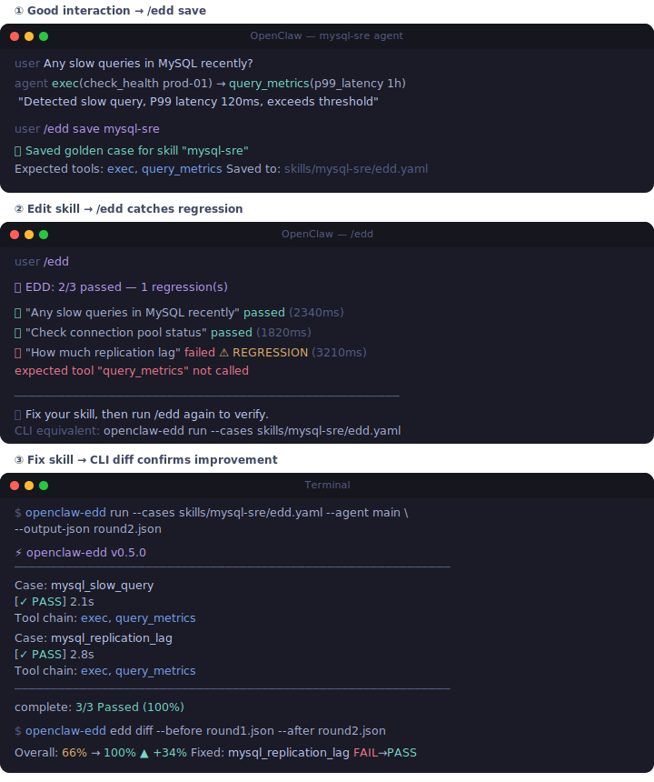
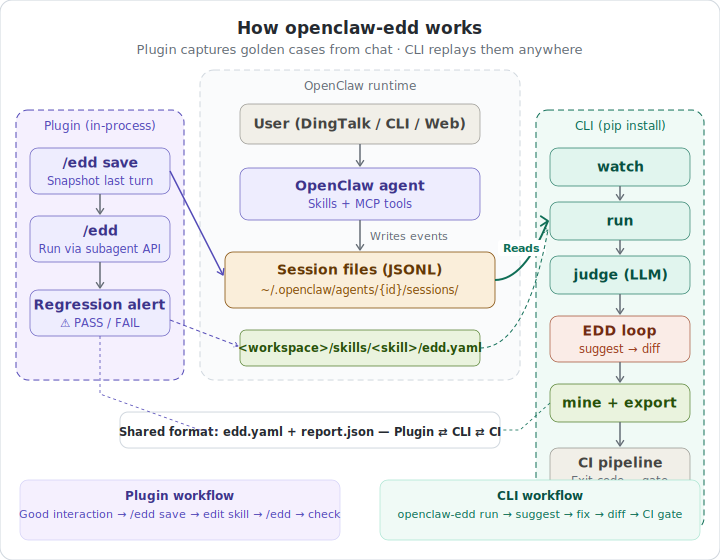
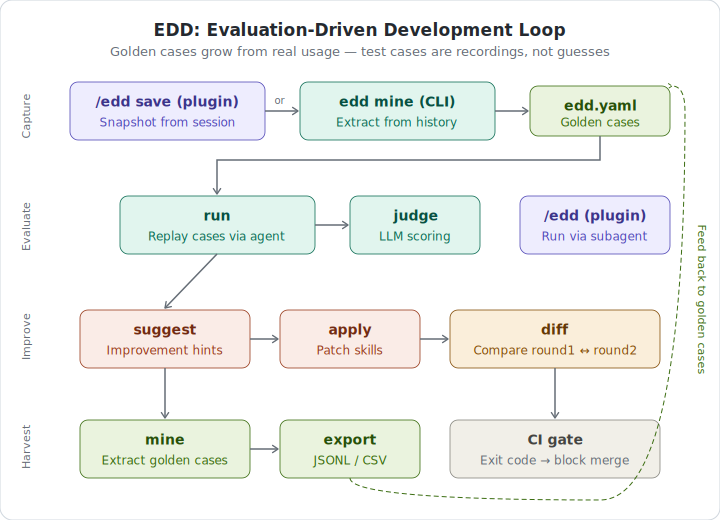

<p align="center">
  
</p>

# openclaw-edd

[](https://github.com/Belyenochi/openclaw-edd/actions)
[](https://pypi.org/project/openclaw-edd/)
[](https://www.npmjs.com/package/openclaw-edd)
[](https://opensource.org/licenses/MIT)

Evaluation-Driven Development for OpenClaw agents — save golden cases from real interactions, catch regressions before they reach users.

[中文文档](README_CN.md)

<p align="center"></p>

## Why

You edit a skill. Did you break something else? There's no way to know without running the agent again — manually, every time. openclaw-edd fixes that: it turns real sessions into test cases and replays them on demand. Skill quality stops depending on "the author says it works" and starts depending on repeatable proof that anyone can run.

## How It Works

openclaw-edd has two entry points that share the same `edd.yaml` format:

- **Plugin** (`/edd save`, `/edd`) — lives inside the OpenClaw chat interface. Save a good interaction as a golden case, replay all cases after editing a skill.
- **CLI** (`openclaw-edd`) — runs anywhere: local terminal, team review, or CI pipeline. Mine cases from session history, compare runs, score with LLM.

Session files are the single source of truth. No instrumentation, no config changes, no gateway restarts required.

<p align="center"></p>

## Quick Start

**Plugin (in chat)**

```
openclaw plugins install openclaw-edd
/edd save          # save a good interaction as a golden case
/edd               # replay all cases after editing a skill
```

**CLI (in terminal)**

```bash
pip install openclaw-edd
openclaw-edd watch                          # see what tools your agent actually uses
openclaw-edd run --quickstart --agent main  # run 6 built-in cases against your agent
```

See the [User Guide](./docs/USER_JOURNEY.md) for the full walkthrough.

## The EDD Loop

<p align="center"></p>

**Capture** — get golden cases into `edd.yaml`
```bash
/edd save                                        # in chat: snapshot a good interaction
openclaw-edd edd mine --output mined.yaml        # from session history
openclaw-edd edd review --input mined.yaml       # approve / reject mined cases
```

**Evaluate** — run cases and collect results
```bash
openclaw-edd run --cases edd.yaml --output-json report.json
openclaw-edd run --quickstart --agent main --summary-line
```

**Improve** — understand what failed and fix it
```bash
openclaw-edd edd suggest --report report.json    # AI-powered suggestions
openclaw-edd edd apply                           # apply suggestions to workspace
openclaw-edd edd judge --report report.json      # LLM scoring across dimensions
```

**Harvest** — measure progress and share results
```bash
openclaw-edd edd diff --before r1.json --after r2.json
openclaw-edd edd export --input golden.jsonl --format csv
```

## Test Case Format

Cases are saved automatically by `/edd save` and editable by hand:

```yaml
cases:
  - id: mysql_slow_query
    message: "Any slow queries in MySQL recently"
    expect_tools: [exec]
    expect_commands: ["check_health"]
    forbidden_commands: ["rm -rf"]
    expect_output_contains: ["slow query"]
    timeout_s: 30
    tags: [mysql, sre]
```

Full field reference (`pass_at_k`, `expect_tool_args`, `eval_type`, `expect_plan_contains`, etc.) — see the [User Guide](./docs/USER_JOURNEY.md).

## Contributing

Questions, ideas, and pull requests are welcome. If something doesn't work or could be better, open an issue — feedback from real usage is how this project improves.

## License

MIT — see [LICENSE](LICENSE) for details.
